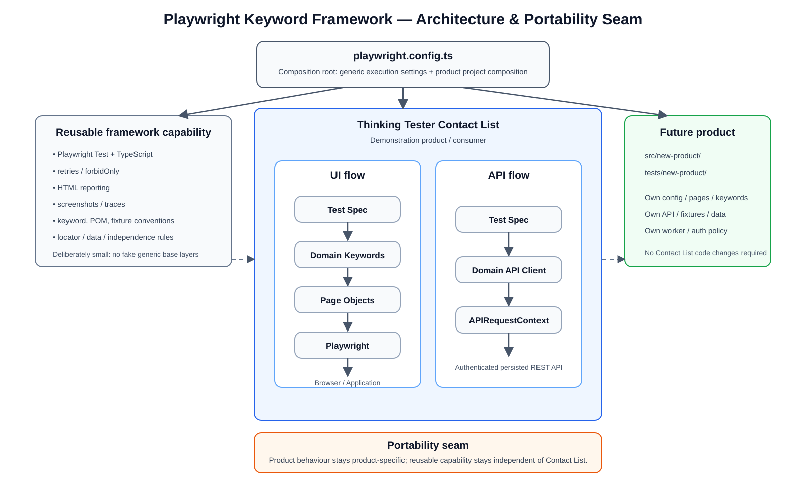

# Framework Design

## 1. Purpose and design goals

This repository is a **keyword-driven Playwright and TypeScript automation framework, demonstrated against the Thinking Tester Contact List application**.

The design is intended for a client team that will inherit the automation after the original author leaves. The primary engineering goals are therefore:

- keep test intent readable to junior automation testers;
- separate reusable framework conventions from product-specific implementation;
- prefer Playwright's built-in capabilities over custom execution layers;
- make failures diagnosable locally and in CI;
- keep tests independent and repeatable against persisted data;
- make a second product possible without rewriting the Contact List implementation.

The framework is deliberately small. Portability is achieved by clear boundaries and conventions, not by making every class generic.

The Thinking Tester Contact List application was selected because one system provides both a real browser UI and a real authenticated REST API whose writes persist. That allows UI and API automation to exercise the same product domain while still proving different behaviours.

## 2. Architecture

The editable architecture source is [`architecture.drawio`](architecture.drawio). The exported diagram is shown below.



There are three main flows.

### UI flow

```text
Test Spec
    ↓
Domain Keywords
    ↓
Page Objects
    ↓
Playwright
    ↓
Browser / Application
```

The **test spec** owns scenario intent, behaviour-focused naming, setup and cleanup decisions, and final assertions.

The **keyword layer** expresses reusable product actions such as `loginAs`, `registerUser`, `addContact`, `openContact`, `updateContact`, and `deleteContact`. Keywords coordinate page objects but do not contain selectors, HTTP behaviour, or final scenario assertions.

The **page-object layer** owns browser mechanics: locators, form filling, clicking, navigation, dialogs, readiness, and assertion-friendly observable state.

This separation keeps tests readable without hiding Playwright behind another execution engine.

### API flow

```text
Test Spec
    ↓
Domain API Client
    ↓
Playwright APIRequestContext
    ↓
Persisted REST API
```

API clients own product endpoints and HTTP mechanics. They deliberately return Playwright `APIResponse` objects for contact CRUD so the test remains responsible for status, body, and persisted-state assertions.

Browser authentication state is not reused by API tests. API authentication uses the real login endpoint to obtain a bearer token at runtime.

### Configuration and composition flow

```text
playwright.config.ts
        ↓
Product Playwright projects
        ↓
Product configuration
        ↓
Environment / Secrets
```

`playwright.config.ts` is the composition root. Generic execution concerns remain global, while Contact List concerns are scoped to Contact List projects.

Global framework execution currently owns:

- CI-only retries;
- Playwright HTML reporting;
- screenshot-on-failure;
- trace-on-first-retry;
- `forbidOnly` in CI.

The Contact List projects own:

- Contact List `baseURL`;
- setup dependency;
- generated `storageState`;
- Contact List test discovery;
- the Contact List one-worker constraint.

This is important because a future product can choose different configuration and concurrency without inheriting Contact List assumptions.

## 3. Why TypeScript

TypeScript is used because it is a strong fit for both Playwright and the junior team inheriting the framework.

It provides:

- first-class Playwright tooling and examples;
- compile-time feedback for page, keyword, fixture, model, and API contracts;
- useful IDE navigation and autocomplete;
- one language across tests and automation infrastructure;
- lightweight typed domain models and factories without an additional runtime framework.

The alternative supported Playwright languages could also satisfy the assessment. TypeScript was chosen because it keeps the implementation close to Playwright's native ecosystem while giving inexperienced maintainers early feedback when they change contracts incorrectly.

## 4. Why keyword-driven TypeScript

The framework is keyword-driven because test intent is expressed through reusable **domain actions**, not because a class happens to contain the word `Keywords`.

For example, an edit scenario expresses the business action through `ContactManagementKeywords.updateContact(...)`. The keyword coordinates the relevant pages; the page objects then perform the browser mechanics.

This gives a junior tester a readable path:

```text
behaviour in spec
    ↓
meaningful keyword
    ↓
page mechanics
```

### Why not Cucumber/Gherkin

Cucumber/Gherkin was deliberately not introduced because there is no demonstrated requirement for non-technical stakeholders to author or maintain executable specifications.

Adding it would create another mapping and debugging layer:

```text
feature text
→ step definition
→ keyword/page implementation
→ Playwright
```

The current TypeScript approach preserves compiler and IDE support, reduces navigation overhead, and still expresses business actions clearly. BDD tooling would be reconsidered if a real client workflow required executable specifications to be owned by non-technical stakeholders.

## 5. Framework and product seam

The Contact List application is a **consumer** of the framework conventions.

Product-specific implementation lives under:

```text
src/contact-list/
tests/contact-list/
```

That includes:

- Contact List routes and environment-variable names;
- page objects and locators;
- Contact List keywords;
- domain models;
- API endpoints and clients;
- test-data factories;
- product fixtures;
- setup and scenarios;
- the shared-account concurrency limitation.

It is correct for classes such as `ContactListPage`, `ContactManagementKeywords`, and `ContactsApiClient` to be coupled to Contact List. Making them generic would remove useful product meaning without making another product easier to automate.

Reusable framework capability currently exists primarily as Playwright/TypeScript tooling and documented conventions rather than a large `src/framework` hierarchy.

### Why there is no `src/framework` directory

No reusable code has yet justified extraction.

Before adding framework-core code, two questions are applied:

1. Would this code still make sense if Contact List disappeared?
2. Does extracting it solve real duplication or materially improve onboarding?

A generic environment helper was considered but rejected because the current implementation has only one product consumer. Creating it now would add indirection without solving a maintenance problem.

This same reasoning is why there is no `BasePage`, `BaseApiClient`, generic HTTP wrapper, keyword interpreter, command registry, or dependency-injection container.

Playwright already supplies the generic browser, HTTP, fixture, assertion, execution, and reporting capabilities. Wrapping them merely to create framework classes would make the handover harder.

## 6. Page objects and locator policy

Page objects are introduced when an automated behaviour requires a meaningful screen. The current product uses:

```text
LoginPage
SignUpPage
ContactListPage
AddContactPage
ContactDetailsPage
EditContactPage
```

The locator policy is applied in this order:

1. role + accessible name;
2. label;
3. placeholder;
4. stable visible text;
5. stable ID or test ID;
6. scoped CSS fallback;
7. XPath only when no safer practical alternative exists.

The objective is not to demonstrate locator variety. The objective is to use the safest locator available from the actual SUT.

Examples from the implementation include:

- `getByRole('button', { name: 'Submit' })` for semantic controls;
- `getByPlaceholder('Email')` where the SUT exposes useful placeholder text;
- `#password` on registration because that password input does not expose a useful associated label;
- `#error` for the login error because the SUT exposes a stable ID and no stronger user-facing relationship.

No XPath is currently used because no current behaviour requires it.

All locators remain inside page objects. Specs receive assertion-friendly locators where a final web-first assertion belongs in the scenario.

## 7. Fixtures and test-data strategy

`tests/contact-list/fixtures/contact-list.fixture.ts` is a **product composition fixture**, not a universal dependency-injection framework.

It assembles the Contact List pages, keywords, and API clients that remove meaningful construction noise from specs. A second product would receive its own fixture rather than extending a global fixture that knows every product.

Test data uses typed TypeScript factories:

```ts
createContact(overrides?)
createTestUser(overrides?)
```

Factories return complete valid objects, allow focused overrides, and generate unique persisted emails/names using a timestamp-and-sequence suffix. This makes repeated runs safer without adding Faker or external datasets.

Static JSON/CSV/Excel data was not introduced because the selected behaviours need valid scenario-owned data rather than large parameter matrices.

## 8. UI and API test strategy

UI and API automation have different responsibilities.

UI scenarios prove user-visible behaviour:

- registration;
- valid and invalid login;
- contact creation and visible saved details;
- contact editing;
- contact deletion.

API scenarios prove authenticated HTTP behaviour and persisted CRUD:

- create and retrieve a persisted contact;
- update and retrieve persisted values;
- delete and verify the resource returns 404.

Two negative scenarios sit alongside the CRUD happy path:

- an unauthenticated `GET /contacts` is refused with 401;
- a contact with an invalid email address is refused with 400 and a field-level validation message.

These exist because the happy-path CRUD tests all carry a valid token and valid data, so on their own they would still pass if authentication or validation were removed from the API. One representative case of each is enough to prove the rule is enforced; see section 14 for why a full validation matrix was not added.

The framework deliberately does not duplicate every API contract through the browser.

Both kinds of scenario are written as Arrange, Act, Assert, with cleanup kept separate in `finally`. This is a readability convention for the specs only: scenario data, recorded IDs, cleanup decisions and final assertions stay in the test, and no assertion or lifecycle abstraction is introduced to enforce the shape. `docs/adding-a-test.md` describes the convention.

### API setup and cleanup in UI tests

API calls are allowed inside UI scenarios only when they support the scenario rather than replace the behaviour being tested.

Examples:

```text
Create behaviour:
UI create → UI verify → API cleanup

Edit behaviour:
API create prerequisite → UI edit → UI verify → API cleanup

Delete behaviour:
API create prerequisite → UI delete → UI verify absence
                         ↘ conditional API cleanup if UI deletion failed

Registration behaviour:
UI register → UI verify authentication → API login as new user → API delete user
```

This keeps each browser test focused while still cleaning persisted data where practical.

## 9. Test independence and concurrency

Every scenario is designed to own the state it needs, tolerate repeated execution, avoid test-order dependencies, and clean persisted data where practical.

Independence and parallelism are different concerns.

The Contact List demonstration uses a configured shared account, and concurrent authentication for that account has proved unreliable against the external SUT. Therefore:

```ts
workers: 1;
```

is scoped only to `contact-list-chromium`.

This is a **Contact List product constraint**, not a framework rule.

Global `fullyParallel: true` was removed because it would impose an aggressive concurrency policy on future products without a demonstrated need. A future product is free to use normal or higher Playwright parallelism based on its own data and environment.

Serial execution does not make these tests dependent on each other; their setup, generated data, assertions, and cleanup remain scenario-owned.

## 10. Authentication strategy

Authentication is deliberately split into three concerns.

### UI authentication behaviour

`authentication.spec.ts` proves:

- new-user registration;
- valid login;
- invalid login.

These tests explicitly start unauthenticated using an empty storage state so the setup project cannot accidentally make a login test pass.

### Shared UI authentication state

The `contact-list-setup` project logs in through the real UI, verifies the Contact List page is loaded, and writes:

```text
playwright/.auth/user.json
```

The authenticated Contact List project reuses this state for scenarios that are not testing login itself. The generated state is ignored by Git.

### API authentication

API clients authenticate through the REST API and obtain a bearer token dynamically. Tokens are not stored in `.env`, committed, or logged.

Registration cleanup intentionally constructs `UsersApiClient` with the newly created user's token rather than exposing a shared users client bound to the configured test account.

## 11. Secrets and environment configuration

Local credentials use a root `.env` file:

```text
CONTACT_LIST_TEST_USER_EMAIL
CONTACT_LIST_TEST_USER_PASSWORD
```

`CONTACT_LIST_BASE_URL` is an optional product override.

`.env.example` is committed with placeholders; `.env`, generated auth state, test results, and Playwright reports are ignored.

Contact List environment-variable names remain owned by `src/contact-list/config/contact-list.config.ts`. They are not treated as universal framework settings.

CI credentials come from GitHub Actions Secrets.

The configured account is intended to be a dedicated automation account with no sensitive or production data.

## 12. CI and reporting

GitHub Actions validates the public repository with a deliberately conservative trust boundary.

For pull requests to `master`:

```text
checkout
→ setup Node
→ npm ci
→ typecheck
→ lint
→ format check
```

Secret-backed E2E execution is not run from pull-request-controlled code.

For trusted pushes to `master`:

```text
checkout
→ setup Node 24
→ npm ci
→ typecheck
→ lint
→ format check
→ install Chromium + OS dependencies
→ npm test
→ upload Playwright HTML report
```

Security and reliability choices include:

- `permissions: contents: read`;
- `persist-credentials: false`;
- GitHub Actions pinned to immutable commit SHAs with readable version comments;
- credentials scoped only to the Playwright test step;
- a 20-minute job timeout;
- Chromium-only installation because Chromium is the current demonstration browser;
- report upload guarded by `always()` so diagnostics are retained after a failed test;
- no `continue-on-error` on the test step, so test failures still fail CI.

Playwright reporting uses:

- built-in HTML report;
- screenshot on failure;
- trace on first retry;
- two retries in CI.

Allure was deliberately excluded because Playwright's native reporting already satisfies the current client and assessment needs with less handover overhead.

### Verified CI evidence

Verified hardened implementation run:

- [GitHub Actions run #3](https://github.com/JBM95/playwright-keyword-framework/actions/runs/33306686692)
- [Playwright report artifact](https://github.com/JBM95/playwright-keyword-framework/actions/runs/33306686692/artifacts/9730698526)

The run completed successfully against commit `6d9426e` and published the `playwright-report` artifact.

## 13. Adding another product

A second product should be added alongside Contact List rather than by modifying Contact List code.

Conceptually:

```text
src/new-product/
├── config/
├── models/
├── pages/
├── keywords/
└── api/

tests/new-product/
├── setup/
├── fixtures/
├── data/
├── ui/
└── api/
```

Onboarding steps are:

1. define product configuration and environment names;
2. add only the domain models needed by the selected behaviours;
3. add page objects for required screens;
4. add meaningful domain keywords;
5. add domain API clients where the product exposes APIs;
6. add typed factories for persisted scenario data;
7. compose a product-specific fixture;
8. add independent UI/API tests;
9. add product Playwright projects with their own `baseURL`, auth state, and worker policy;
10. add product-specific CI secrets and execution as required.

Nothing inside `src/contact-list/` or `tests/contact-list/` should need to change.

If two or more real products later duplicate infrastructure with the same semantic responsibility, that is the point to consider extracting shared framework code.

## 14. Deliberate exclusions

The first delivery deliberately excludes:

- Cucumber/Gherkin and external keyword files;
- a custom keyword interpreter;
- `BasePage` / `BaseApiClient` inheritance;
- generic HTTP or repository wrappers;
- dependency-injection containers;
- Faker and broad external data tooling;
- Allure;
- Docker;
- database access or service virtualization;
- cross-browser CI matrices;
- visual regression;
- exhaustive validation/boundary matrices;
- full Users API CRUD;
- PATCH coverage simply for extra test count;
- arbitrary sleeps or generic retry wrappers.

These are not rejected permanently. They are deferred until a real product requirement or repeated maintenance problem justifies their cost.

## 15. What would be built next

The next improvements would be driven by evidence rather than by adding patterns pre-emptively.

Likely candidates are:

- add another real product to prove and refine the portability seam;
- extract genuinely duplicated cross-product utilities only after that second consumer exists;
- add cross-browser or environment coverage when the supported product matrix requires it;
- expand validation and edge-case coverage according to risk;
- add richer reporting only if stakeholders need capabilities beyond Playwright HTML, screenshots, and traces.

The governing rule is:

> **Do not generalise product behaviour. Extract only genuinely reusable capability, and keep the framework simple enough that the inheriting team can explain and extend it.**
